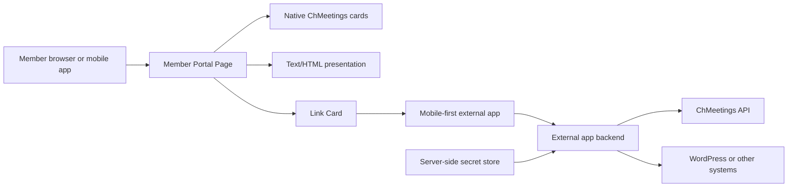

# ChMeetings Member Portal Builder Architecture and UX Guide

Last verified: 2026-07-15

Applies to: VAY SM / Sports Fest, RPC, and other ChMeetings tenants maintained
by the `i12know` project portfolio.

Audience:

- LLMs designing or implementing ChMeetings integrations.
- Human developers and reviewers.
- "Web Builders" working in **Member Portal > Builder**.
- Product owners deciding what belongs in ChMeetings versus an external app.

Related orientation:
[Web Entrypoints and Member Portal Notes](WEB_ENTRYPOINTS_AND_MEMBER_PORTAL.md).

Before seasonal customization, run the read-only contract check in the
[Member Portal Validation Runbook](MEMBER_PORTAL_VALIDATION_RUNBOOK.md). It
compares current official documentation, public routes, and the open Builder tab
with a reviewed baseline and reports drift without changing ChMeetings.

## Executive rules

Treat the Member Portal Builder as a constrained app/content composer, not as a
general-purpose website host.

1. Use a native ChMeetings card whenever one fits the task.
2. Use Pages to organize content and Link Cards to open external experiences.
3. Use Text/HTML Cards for presentational content, not application logic.
4. Use only the visual controls and rich-text formatting ChMeetings documents.
   Do not depend on hand-authored global CSS.
5. Do not inject JavaScript into Builder content.
6. Treat an arbitrary iframe as undocumented and experimental, not as the
   default integration method.
7. Keep ChMeetings API keys and all privileged data access on a server. Never
   put an API key in HTML, JavaScript, a URL, or a mobile client.
8. Preview Guest and Member layouts in Builder, then test the real public page
   and a real ordinary member account. The phone preview is not an end-to-end
   test.

The short architectural answer is:

| Question | Project policy |
|---|---|
| Can Builder do more than text or HTML? | Yes. It has native cards for pages, links, forms, events, calendars, media, maps, feeds, giving, and more. |
| Can we use CSS? | Use documented colors, margins, appearance settings, and editor-generated formatting. A custom stylesheet, global selectors, or a theme override is not a supported contract. |
| Can we use JavaScript? | No. It is undocumented, unsafe, and prohibited for our Builder content even if a particular snippet happens to work today. |
| Can we use an iframe? | ChMeetings does not document arbitrary iframes in Text/HTML Cards. Pilot one only after native cards and an external link have been ruled out. |
| How should a dynamic external app integrate? | Open a mobile-first HTTPS app from a Link Card or shared Page. Authenticate there, call ChMeetings from its backend, and return a fast, focused task flow. |

## Evidence vocabulary

Every contributor should label capability claims using one of these terms:

| Label | Meaning | May be used in production? |
|---|---|---|
| **Supported** | Explicitly documented by ChMeetings and present in the current UI. | Yes, after normal testing. |
| **Observed** | Seen in the live VAY Builder or portal, but not necessarily documented as a contract. | Only with regression testing and a fallback. |
| **Experimental** | Plausible but undocumented, such as an arbitrary iframe. | Only in a disposable pilot with approval. |
| **Prohibited** | Unacceptably fragile or unsafe for this portfolio, such as injected JavaScript or a browser-side API key. | No. |

Do not turn an observation into a supported capability. Browser internals,
rendered markup, or a successful one-time paste do not guarantee that the same
content will survive sanitization, a ChMeetings update, or the mobile app.

## Supported Builder capabilities

The Builder is available from the desktop/web admin interface. The resulting
Member Portal runs on the web and in the mobile app. It provides:

- A default home page and additional Pages.
- Cards arranged directly on a page or grouped in Container layouts.
- Card and Page visibility for Members, Guests, or Both.
- Publish and expiry dates.
- Direct Page links and QR codes.
- A Guest/Member phone preview.
- Member app menu management, subject to plan and branded-app entitlements.
- Tenant-level colors, banners, logos, and selected appearance controls.
- Additional branded-app capabilities such as the Media Card and appearance
  options, subject to the tenant's subscription.

ChMeetings documents the following card catalog. Prefer the card that owns the
domain behavior instead of recreating it in HTML.

| Card | Best use | Design note |
|---|---|---|
| Container | Two, three, or horizontally scrolling cards in one row | Keep mobile labels and images short; do not create a dense dashboard. |
| Page | A focused destination or submenu | Use for detail; keep the home page as a task launcher. |
| Link | Any external web page or custom app | Preferred boundary for external systems. Include a clear title, image, and outcome. |
| Text/HTML | Formatted copy, lists, simple tables, images, and static HTML | Presentation only. Do not make it an application runtime. |
| Form | A ChMeetings form | Preferred for data collection because member/app context stays native. |
| Event | A specific ChMeetings event and registration | Preserves event visibility and eligibility rules. |
| Upcoming Events | A rolling event list | Better than manually maintaining an HTML schedule. |
| Calendar | Day, week, month, or agenda event view | Use when users need to scan dates rather than act on one event. |
| Donate Button | ChMeetings giving or a custom giving link | Keep payment behavior in the supported provider flow. |
| Google Map | A location and navigation | Prefer this to a hand-built map embed. |
| Photo | Up to 15 images | Supply alternative text; ChMeetings recommends images no larger than 800 x 250 px. |
| Video | YouTube, Vimeo, Dailymotion, supported social links, MP4, playlists, or live video | Use a provider's share link. It can play supported content inside the app. |
| Audio | Supported audio providers, Google Drive, or direct audio | Better than custom audio markup. |
| Media | Series, audio, video, PDF, or PowerPoint from Media Library | Branded App entitlement required. |
| Article | One ChMeetings blog article | Good for long-form maintained content. |
| Blog | A filtered list of posts | Prefer for recurring news. |
| RSS Feed | Items from an RSS source | Useful when another system is the content source of record. |
| Live Streaming | A link to a stream | Opens an external link; use Video Card when supported in-app playback is desired. |
| Social Media Links | Supported social and communication profiles | Use once as a compact footer or contact area. |
| Verse of the Day | Bible Gateway daily verse | Native dynamic content with no custom code. |

Entitlements can differ between a regular paid account and a Branded App. The
official articles were not fully consistent about which menu and appearance
features require the Branded App as of this review. Verify the controls in the
target tenant and plan before promising them. Do not infer RPC capability from
VAY SM, or VAY SM capability from RPC.

## HTML, CSS, JavaScript, and iframe boundary

### Text and HTML: supported for presentation

ChMeetings explicitly documents that a Text/HTML Card can format text, add
images, and render supplied HTML. Good uses include:

- A short welcome or event notice.
- Headings, paragraphs, lists, and links.
- A simple static image with meaningful alternative text.
- A small comparison or schedule table when no native card fits.
- A short bilingual content block.

Keep the HTML semantic and shallow. Prefer the Builder's editor output. Avoid
custom forms, complex layout tables, fixed pixel widths, absolute positioning,
external trackers, and anything that depends on a specific DOM structure.

Store an editable source copy of important Text/HTML content outside the
Builder, ideally in the owning project's documentation. Builder deletion is
irreversible and copied rich text is easier to review than a screenshot.

### CSS: constrained, not a custom theme surface

Supported styling comes from ChMeetings controls, including the main app color,
card colors where offered, Page background and margins, text alignment, banners,
and branded-app light/dark appearance options. The rich-text editor may also
produce formatting as part of its HTML.

ChMeetings states that the app is not open to section-specific custom design.
Therefore:

- Do not add a `<style>` block or link an external stylesheet.
- Do not target ChMeetings classes, IDs, or surrounding DOM elements.
- Do not depend on CSS variables or selectors discovered in DevTools.
- Treat hand-authored inline `style` attributes as undocumented. Remove them if
  the same result is available through Builder controls or simple HTML.
- Never use CSS to hide security, consent, navigation, or account controls.

The Text/HTML card guide says its background and text color can be configured,
while the general Manage Content article lists a narrower group of color-aware
cards. When documentation and the live editor differ, record the discrepancy
and follow the live supported control rather than inserting custom CSS.

### JavaScript: prohibited

No official Builder documentation grants a custom JavaScript capability. Do
not use:

- `<script>` tags.
- Inline event attributes such as `onclick` or `onload`.
- `javascript:` URLs.
- Third-party widgets that require script injection.
- Analytics, tag managers, chat widgets, or authentication code pasted into a
  Text/HTML Card.

The reasons are architectural, not cosmetic: script injection creates an XSS
and privacy boundary, may be stripped by sanitization, can behave differently
inside a mobile webview, and can break without notice when ChMeetings changes
its rendering or Content Security Policy.

If a feature requires JavaScript, host it in an external application that we
control and open it with a Link Card.

### Arbitrary iframe: undocumented and last resort

ChMeetings documents iframe/embed code for placing public ChMeetings events,
calendars, and forms into an external website. That is the opposite direction
from placing an arbitrary external website inside a ChMeetings Text/HTML Card.
Do not use the former as proof that the latter is supported.

Some native cards may internally render provider content in frames. This also
does not create a general iframe contract for Builder authors.

Prefer a Link Card because it gives the external app its own viewport, native
scrolling, predictable authentication, and a usable back/close path. An iframe
often introduces nested scrolling, keyboard and focus problems, fixed-height
content, third-party-cookie failures, and unclear navigation inside a mobile
app.

If an iframe is still necessary, use the pilot procedure below. It is not
approved for production until every step passes.

1. Ask ChMeetings Support whether arbitrary frames in Text/HTML Cards are
   supported on web, iOS, and Android.
2. Create a temporary, unlisted test Page with synthetic public content and no
   personal data.
3. Use HTTPS and allow framing only from verified ChMeetings web/app origins.
   Do not weaken `Content-Security-Policy: frame-ancestors` to `*` just to make
   a test pass. A restrictive `X-Frame-Options` header can also block the frame;
   do not remove that protection globally to accommodate one experiment.
4. Do not rely on third-party cookies. Require an explicit sign-in or a secure
   first-party session in the external app.
5. Request the minimum frame permissions. Do not enable camera, microphone,
   location, popups, or downloads unless the use case requires and tests them.
6. Keep the embedded task short and avoid a second header, footer, or navigation
   system. Cross-origin automatic height usually requires cooperation from the
   parent page, which Builder does not document.
7. Provide a normal HTTPS fallback link next to the experiment.
8. Test Guest, ordinary Member, and Admin contexts on desktop web, iOS, and
   Android, including keyboard input, rotation, screen readers, slow networks,
   app background/resume, and the Back action.
9. Record the tested ChMeetings version, target origin, required permissions,
   screenshots, known limitations, owner, and rollback date.
10. Remove the iframe if any supported client strips it, clips it, loses user
    input, or cannot provide an obvious escape path.

## Integration decision model

Choose the first tier that satisfies the user task.

| Tier | Pattern | Use when | Reliability |
|---|---|---|---|
| 1 | Native ChMeetings card | ChMeetings already owns the data or workflow | Highest |
| 2 | Builder Page composed from native cards | The task needs a focused destination or grouped content | High |
| 3 | Link Card to a responsive external app | The feature needs custom UI, logic, identity, or data from another system | High when tested |
| 4 | Text/HTML Card | The content is static and presentational | Moderate to high when kept simple |
| 5 | Experimental iframe | The user must remain visually inside the Page and a link is demonstrably inadequate | Low and entitlement/client dependent |
| 6 | Injected JavaScript | Never | Prohibited |



Ask these questions in order:

1. Is there a native card for this content or action?
2. Can Pages, audience visibility, and publish/expiry dates solve it without
   custom code?
3. Is the missing piece only static presentation? Use Text/HTML.
4. Does it require personalization, business logic, data joins, or a custom
   interaction? Build an external app and use a Link Card.
5. Is remaining inside a ChMeetings Page a verified requirement rather than an
   assumption? Only then evaluate an iframe pilot.

## External app architecture

An external app is the preferred extension point for dynamic features such as
personalized Sports Fest badges, roster tools, approvals, or data combined from
ChMeetings and WordPress.

### Security boundary

The browser or mobile client communicates with our external application over
HTTPS. Only that application's backend calls ChMeetings. The backend owns the
ChMeetings API key, authorizes the current user, validates tenant and ministry
scope, and returns only the minimum data needed by the screen. Treat the API key
as a service credential, never as member authentication.

Do not:

- Call the ChMeetings API directly from browser JavaScript.
- Put an API key in a Link Card, HTML field, iframe URL, source map, or mobile
  bundle.
- Treat a visible ChMeetings `PersonId`, email address, or phone number as proof
  of identity.
- Put personal information or a permanent bearer token in a shareable URL.
- Assume ChMeetings login cookies or member identity transfer to another domain.

No documented Member Portal SSO or per-member merge token for Text/HTML/Link
Cards was found during this review. A static Builder card cannot safely mint a
different signed URL for every member. Until ChMeetings documents such a
facility, a personalized external app needs its own identity flow, such as an
existing VAYSF/WordPress account or a short-lived magic link sent to a verified
email or phone. Perform the ChMeetings person mapping on the backend.

ChMeetings does document merge fields in other, specific editors, such as the
Registration Thank You Message. Do not assume those fields are available in a
Text/HTML Card or Link Card unless that exact Builder control documents and
renders them.

If a future ChMeetings feature provides signed identity handoff, document its
issuer, audience, expiry, replay protection, logout behavior, and mobile support
before adopting it.

### Mobile UX contract

Build the external experience as a task surface that may open in an in-app
browser or the system browser:

- Use responsive, single-column layouts first.
- Use standard HTTPS links. Do not assume an app deep link works until it is
  tested from both iOS and Android ChMeetings clients.
- Keep the first meaningful screen fast. Target useful content within two
  seconds on a normal mobile connection and show a compact loading state.
- Use touch targets of at least 44 x 44 CSS pixels and never depend on hover.
- Preserve entered form state when the app backgrounds or the browser reloads.
- Keep one primary action per screen and put errors next to the field or action
  that caused them.
- Avoid duplicating ChMeetings-style bottom navigation inside the external app.
- Make Back/Close behavior obvious. Browser Back should return to the portal
  when possible; provide a tested VAY Connect return link only as a fallback.
- Use accessible labels, visible focus, useful alternative text, sufficient
  contrast, and text that survives browser zoom.
- Keep English and Vietnamese labels short and test both. Do not assume custom
  menu labels are translated automatically.
- Avoid new tabs, popups, forced downloads, and long PDF-first workflows on a
  phone. Offer an HTML summary before a document link when practical.
- Explain when a task leaves ChMeetings only when that context prevents user
  confusion. Keep the home page free of long operating instructions.

### Failure behavior

Every external integration needs:

- A friendly unavailable state with a retry action.
- A non-JavaScript fallback for the most important link or contact path.
- Timeouts and bounded retries on backend API calls.
- Correlation IDs in logs without exposing API keys or unnecessary PII.
- A support contact and an owner who can disable the Link Card quickly.
- A safe behavior when the user is not authorized, the member mapping is
  missing, or ChMeetings is temporarily unavailable.

## Portal information architecture

Design the default page as a launchpad, not a document dump.

### Guest home

Prioritize orientation and public actions:

- Brand/event identity and one concise welcome.
- Register or create an account.
- Public schedule and location.
- Public handbook or safety notice.
- Help/contact information.

Guest cards must not reveal member-only resources merely because the underlying
URL is difficult to guess. Protect data at the destination as well as through
Builder visibility.

### Member home

Prioritize repeat tasks and personalized destinations:

- The next event or registration action.
- My registration, ticket, badge, or check-in destination when supported.
- Schedule and location.
- Required forms or profile actions.
- Help/contact information.

Use `Members` visibility for member actions and `Guests` visibility for account
creation or public orientation. Shared announcements can use `Both`. A member
should not have to scroll through the guest onboarding journey every time they
open the app.

### Page structure

- Keep the default home page to a small set of high-value actions. As a working
  target, show three to seven primary choices before secondary content.
- Use Page Cards for details and group related cards together.
- Avoid more than two navigation levels. Deeply nested Page Cards are difficult
  to understand on a phone.
- Prefer task labels such as `Register for Sports Fest` or `View My Badge` over
  vague labels such as `Learn More`.
- Use one visual language, but do not try to imitate ChMeetings with fragile
  custom CSS.
- Schedule temporary content with Publish and Expiry dates. Assign an owner to
  permanent content and review it at least annually.

## Sports Fest reference design

This is a recommended starting point, not a statement that every listed feature
is already configured.

| User need | Preferred implementation | Fallback |
|---|---|---|
| Sports Fest overview | Page with short Text/HTML plus native cards | Article or public external page |
| Registration | Event Card and/or Form Card | Verified direct ChMeetings registration link |
| Upcoming schedule | Upcoming Events or Calendar Card | Maintained HTML summary plus downloadable schedule |
| Handbook and safety notice | Article, Link, or Media Card when entitled | Mobile-friendly external HTML page; PDF second |
| Facility directions | Google Map Card | Link to a map provider |
| Public updates | Article, Blog, RSS, or Text/HTML | External updates page |
| Personalized badge | Link Card to an authenticated VAYSF app | ChMeetings-native ticket/QR feature if it meets the requirement |
| Check-in | ChMeetings-native event/check-in flow | External app only after workflow and identity review |
| Contact/help | Short Text/HTML and supported communication link | External help page |

For a personalized badge, do not place a predictable person number or image URL
in static HTML. Open a secure external badge page, authenticate the athlete or
parent, authorize access on the backend, and return only the correct badge. A
generic Link Card can launch that app; it cannot by itself identify the signed-in
ChMeetings member.

## Web Builder operating procedure

### Before editing

1. Use a least-privilege custom role with Builder permission. People and other
   administrative permissions should remain off unless the editor's job truly
   requires them.
2. Name the tenant, Page, audience, user task, content owner, and expiry date.
3. Confirm the target account's plan and branded-app entitlements.
4. Read the current [entrypoint notes](WEB_ENTRYPOINTS_AND_MEMBER_PORTAL.md) so
   the admin Builder, Guest page, Member page, and shared tenant root are not
   confused.
5. Choose the highest supported integration tier in this guide.
6. Preserve the current content. Duplicate reusable cards and keep source copy
   for important HTML. Page and card deletion cannot be undone.

### While editing

1. Use the correct Card rather than a visual approximation in HTML.
2. Check visibility immediately after adding a Card because the addition is
   automatically saved. Set it deliberately to Members, Guests, or Both.
3. Set Publish and Expiry dates for campaigns and events.
4. Supply descriptive alternative text for images.
5. Click **Save** after card configuration changes. Dragging/reordering may save
   automatically, but edited card configuration requires an explicit Save.
6. Compare Guest and Member phone previews after each meaningful change.
7. Do not paste secrets, API keys, private identifiers, JavaScript, trackers, or
   unreviewed third-party embed code.

### Before publishing or sharing

Test this matrix:

| Context | Required check |
|---|---|
| Fresh anonymous desktop browser | Correct tenant, Guest visibility, login behavior, and direct-link routing |
| Ordinary member browser account | Real Member home, permissions, back navigation, and direct-link routing |
| Admin/staff browser | Ensure admin redirects are not mistaken for member behavior |
| iPhone app/device | Layout, links, keyboard, Back/Close, authentication, and resume behavior |
| Android app/device | Layout, links, keyboard, Back/Close, authentication, and resume behavior |
| Slow or interrupted network | Loading, retry, saved input, and friendly failure behavior |
| Accessibility pass | Zoom, contrast, labels, focus, screen reader, and alternative text |

Builder's right-side phone view is useful for layout and audience comparison,
but it is a simulation rendered inside the admin page. It does not prove that a
public URL, member authentication redirect, external link, iframe, or mobile app
flow works end to end.

### Change record

For each important Page or external integration, record:

```text
Tenant:
Builder Page:
Public/member URL:
Audience: Guest / Member / Both
Primary task:
Cards used:
External origin, if any:
Authentication method:
Owner:
Publish date:
Expiry/review date:
Tested clients and login states:
Known limitations:
Rollback action:
Last verified ChMeetings version/date:
```

## Instructions for LLM contributors

Before recommending or changing Builder content:

1. Run the validation command from the
   [Member Portal Validation Runbook](MEMBER_PORTAL_VALIDATION_RUNBOOK.md). Do
   not proceed past a warning or failure until the difference is reviewed.
2. Check the current ChMeetings Help Center and release notes. Builder features
   change more frequently than this repository.
3. Inspect the live tenant only when the user authorizes it. Do not publish,
   save, reorder, delete, or toggle visibility during a read-only investigation.
4. Separate official documentation, live observation, and inference in the
   answer and in committed notes.
5. Never infer arbitrary CSS, JavaScript, iframe, merge-field, deep-link, or SSO
   support from browser source code or from another tenant.
6. Prefer native cards and official share links. If proposing an external app,
   document identity, authorization, API-key custody, mobile navigation, failure
   states, and test coverage.
7. Never use an admin session as evidence of a normal member journey.
8. Add new verified findings to this guide or the entrypoint notes with the date,
   tenant, exact route/context, and ChMeetings documentation source.

## Open questions requiring direct tests

These were not established as supported capabilities on 2026-07-15:

- Arbitrary iframe rendering in Text/HTML Cards on all clients.
- Hand-authored CSS beyond editor output and documented visual controls.
- Any custom JavaScript execution.
- Per-member merge variables in Text/HTML or Link Cards.
- A signed member identity or SSO handoff to an external application.
- The exact live Member URL and redirect behavior for an ordinary VAY SM member.
- Whether every Builder feature shown in one tenant is included in another
  tenant's paid or Branded App plan.

An unknown is not permission to guess. Open a disposable Page, use synthetic
data, test every supported client, ask ChMeetings Support when needed, and record
the result before changing this status.

## Official sources

- [Builder Cards List & Guide](https://help.chmeetings.com/hc/en-us/articles/17947186556828-Builder-Cards-List-Guide)
- [Manage Content](https://help.chmeetings.com/hc/en-us/articles/17947454929820-Manage-Content)
- [Get To Know The Member Portal Builder](https://help.chmeetings.com/hc/en-us/articles/4411175383441-Get-To-Know-The-Member-Portal-Builder)
- [Configure Member Portal Appearance Settings](https://help.chmeetings.com/hc/en-us/articles/17946828994204-Configure-Member-Portal-Appearance-Settings)
- [How can I add my own design to specific app sections?](https://help.chmeetings.com/hc/en-us/articles/28036914196124-How-can-I-add-my-own-design-to-specific-app-sections)
- [Website Integration](https://help.chmeetings.com/hc/en-us/articles/11107321017245-Website-Integration)
- [Configure the Member Portal](https://help.chmeetings.com/hc/en-us/articles/360020865037-Configure-the-Member-Portal)
- [How Does the Member Portal Work?](https://help.chmeetings.com/hc/en-us/articles/4402940272401-How-Does-the-Member-Portal-Work)
- [Managing users, roles and permissions](https://help.chmeetings.com/hc/en-us/articles/4402100721297-Managing-users-roles-and-permissions)
- [Developer API Guide](https://help.chmeetings.com/hc/en-us/articles/4407466673937-Developer-API-Guide)

When a source and the current tenant UI disagree, document both, use the more
conservative capability, and ask ChMeetings Support before building a dependency
on the difference.
